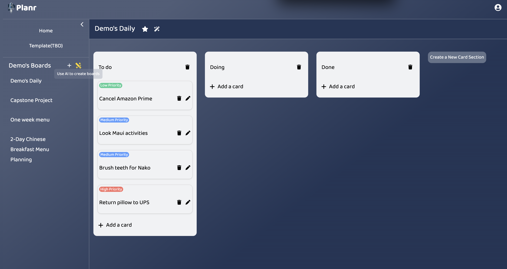

# Planr

**Planr** is a task management web app designed to simplify planning and organizing. It offers an easy-to-use interface with features like full CRUD task boards, drag-and-drop task cards, and customizable templates. What sets Planr apart is its AI-powered planning assistant, which helps users generate structured task lists and timelines based on their goals.



## Technologies used
- OpenAI
- Redux
- Flask
- React
- React Dnd
- SQLAlchemy

## Language
- JS
- Python

## Instuction on Launching Locally
1. **Build Dependency**
```bash
pipenv install -r requirements.txt
```

2. **Run database**
```bash
flask db upgrade && flask seed all
```

3. **Run backend server**
```bash
flask run
```

4. **Run frontend server**
```bash
cd react-vite && npm run dev
```