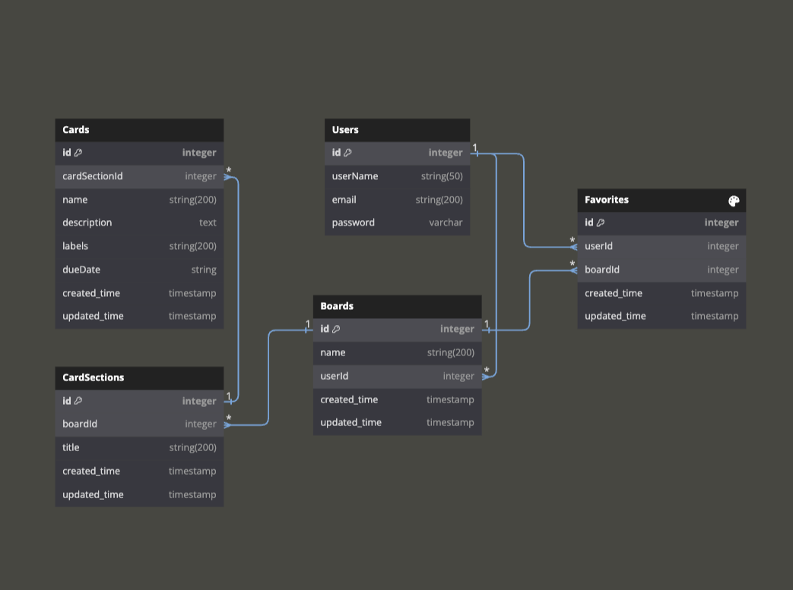

# Planr Website

## Database Schema Design



## API Documentation

## USER AUTHENTICATION/AUTHORIZATION

### All endpoints that require authentication

All endpoints that require a current user to be logged in.

* Request: endpoints that require authentication
* Error Response: Require authentication
  * Status Code: 401
  * Headers:
    * Content-Type: application/json
  * Body:

    ```json
    {
      "message": "Authentication required"
    }
    ```

### All endpoints that require proper authorization

All endpoints that require authentication and the current user does not have the
correct role(s) or permission(s).

* Request: endpoints that require proper authorization
* Error Response: Require proper authorization
  * Status Code: 403
  * Headers:
    * Content-Type: application/json
  * Body:

    ```json
    {
      "message": "Forbidden"
    }
    ```

### Get the Current User

Returns the information about the current user that is logged in.

* Require Authentication: false
* Request
  * Method: GET
  * Route path: /api/auth/
  * Body: none

* Successful Response when there is a logged in user
  * Status Code: 200
  * Headers:
    * Content-Type: application/json
  * Body:

    ```json
    {
      "user": {
        "id": 1,
        "email": "demo@aa.io",
        "username": "Demo"
      }
    }
    ```

* Response when there is no logged in user
  * Status Code: 401
  * Headers:
    * Content-Type: application/json
  * Body:

    ```json
    {
        "errors": {
            "message": "Unauthorized"
        }
    }
    ```

### Log In a User

Logs in a current user with valid credentials and returns the current user's
information.

* Require Authentication: false
* Request
  * Method: POST
  * Route path: /api/auth/login
  * Headers:
    * Content-Type: application/json
  * Body:

    ```json
    {
      "email": "demo@aa.io",
      "password": "password"
    }
    ```

* Successful Response
  * Status Code: 200
  * Headers:
    * Content-Type: application/json
  * Body:

    ```json
    {
      "email": "demo@aa.io",
      "id": 1,
      "username": "Demo"
    }
    ```

* Error Response: Invalid credentials
  * Status Code: 401
  * Headers:
    * Content-Type: application/json
  * Body:

    ```json
    {
      "email": [
          "Email provided not found."
      ],
      "password": [
          "No such user exists."
      ]
    }
    ```

* Error response: Body validation errors
  * Status Code: 400
  * Headers:
    * Content-Type: application/json
  * Body:

    ```json
    {
      "email": [
        "This field is required."
      ],
      "password": [
        "This field is required."
      ]
    }
    ```

### Sign Up a User

Creates a new user, logs them in as the current user, and returns the current
user's information.

* Require Authentication: false
* Request
  * Method: POST
  * Route path: /api/auth/signup
  * Headers:
    * Content-Type: application/json
  * Body:

    ```json
    {
      "username": "luna",
      "email": "luna@luna.com",
      "password": "password"
    }
    ```

* Successful Response
  * Status Code: 200
  * Headers:
    * Content-Type: application/json
  * Body:

    ```json
    {
      "email": "luna@luna.com",
      "id": 5,
      "username": "luna"
    }
    ```

* Error response: User already exists with the specified email or username
  * Status Code: 401
  * Headers:
    * Content-Type: application/json
  * Body:

    ```json
    {
      "email": [
        "Email address is already in use."
      ],
      "username": [
        "Username is already in use."
      ]
    }
    ```

* Error response: Body validation errors
  * Status Code: 400
  * Headers:
    * Content-Type: application/json
  * Body:

    ```json
    {
      "email": [
          "This field is required."
      ],
      "password": [
          "This field is required."
      ],
      "username": [
          "This field is required."
      ]
    }
    ```

## Boards

### Get all Boards owned by the Current User

Returns all the boards owned by the current user.

* Require Authentication: true
* Request
  * Method: GET
  * Route path: /api/boards/current
  * Body: none

* Successful Response
  * Status Code: 200
  * Headers:
    * Content-Type: application/json
  * Body:

    ```json
    {
      "Boards": [
        {
          "id": 1,
          "userId": 1,
          "name": "Demo's Daily",
          "createdAt": "2021-11-19 20:39:36",
          "updatedAt": "2021-11-19 20:39:36",
        }
      ]
    }
    ```

### Get details of a Board from an id

Returns the details of a board specified by its id.

* Require Authentication: false
* Request
  * Method: GET
  * Route path: /api/board/:boardId
  * Body: none

* Successful Response
  * Status Code: 200
  * Headers:
    * Content-Type: application/json
  * Body:

    ```json
    {
      "id": 1,
      "userId": 1,
      "name": "Demo's Daily",
      "createdAt": "2021-11-19 20:39:36",
      "updatedAt": "2021-11-19 20:39:36",
      "CardSections": [
        {
          "id": 1,
          "title": "To do",
          "createdAt": "2021-11-19 20:39:36",
          "updatedAt": "2021-11-19 20:39:36",
          "Cards": [
            {
              "id":1,
              "name": "Design database",
              "description": "use dbdiagram to design tables",
              "labels": "High Priority",
              "dueDate": "2024-10-10 19:00:00",
              "createdAt": "2021-11-19 20:39:36",
              "updatedAt": "2021-11-19 20:39:36" ,             
            }
          ]
        },
        {
          "id": 2,
          "title": "Doing",
          "createdAt": "2021-11-19 20:39:36",
          "updatedAt": "2021-11-19 20:39:36",
          "Cards": [
            {
              "id":2,
              "name": "Go vet",
              "description": "take nako to vaccinate",
              "labels": "Middle Priority",
              "dueDate": "2024-10-20 19:00:00",
              "createdAt": "2021-11-19 20:39:36",
              "updatedAt": "2021-11-19 20:39:36" ,             
            }
          ]
        },
      ],

    }
    ```

* Error response: Couldn't find a Board with the specified id
  * Status Code: 404
  * Headers:
    * Content-Type: application/json
  * Body:

    ```json
    {
      "message": "Board couldn't be found"
    }
    ```

### Create a Board

Creates and returns a new board.

* Require Authentication: true
* Request
  * Method: POST
  * Route path: /api/boards
  * Headers:
    * Content-Type: application/json
  * Body:

    ```json
    {
      "name": "App Academy",
    }
    ```

* Successful Response
  * Status Code: 201
  * Headers:
    * Content-Type: application/json
  * Body:

    ```json
    {
      "id": 1,
      "userId": 1,
      "name": "App Academy",
      "createdAt": "2021-11-19 20:39:36",
      "updatedAt": "2021-11-19 20:39:36"
    }
    ```

* Error Response: Body validation errors
  * Status Code: 400
  * Headers:
    * Content-Type: application/json
  * Body:

    ```json
    {
      "message": "Bad Request", // (or "Validation error" if generated by Sequelize),
      "errors": {
        "name": "Name must be less than 50 characters",
      }
    }
    ```

### Edit a Board

Updates and returns an existing board.

* Require Authentication: true
* Require proper authorization: board must belong to the current user
* Request
  * Method: PUT
  * Route path: /api/board/:boardId
  * Headers:
    * Content-Type: application/json
  * Body:

    ```json
    {
      "name": "App Academy",
    }
    ```

* Successful Response
  * Status Code: 200
  * Headers:
    * Content-Type: application/json
  * Body:

    ```json
    {
      "id": 1,
      "userId": 1,
      "name": "App Academy",
      "createdAt": "2021-11-19 20:39:36",
      "updatedAt": "2021-11-20 10:06:40"
    }
    ```

* Error Response: Body validation errors
  * Status Code: 400
  * Headers:
    * Content-Type: application/json
  * Body:

    ```json
    {
      "message": "Bad Request", // (or "Validation error" if generated by Sequelize),
      "errors": {
        "name": "Name must be less than 50 characters",
      }
    }
    ```

* Error response: Couldn't find a Board with the specified id
  * Status Code: 404
  * Headers:
    * Content-Type: application/json
  * Body:

    ```json
    {
      "message": "Board couldn't be found"
    }
    ```

### Delete a Board

Deletes an existing board.

* Require Authentication: true
* Require proper authorization: board must belong to the current user
* Request
  * Method: DELETE
  * Route path: /api/boards/:boardId
  * Body: none

* Successful Response
  * Status Code: 200
  * Headers:
    * Content-Type: application/json
  * Body:

    ```json
    {
      "message": "Successfully deleted"
    }
    ```

* Error response: Couldn't find a Board with the specified id
  * Status Code: 404
  * Headers:
    * Content-Type: application/json
  * Body:

    ```json
    {
      "message": "Board couldn't be found"
    }
    ```

## CardSections

### Get all CardSections by a Board's id

Returns all the cardSections that belong to a board specified by board id.

* Require Authentication: true
* Request
  * Method: GET
  * Route path: /api/boards/:boardId/card-sections
  * Body: none

* Successful Response
  * Status Code: 200
  * Headers:
    * Content-Type: application/json
  * Body:

    ```json
    {
      "CardSections": [
        {
          "id": 1,
          "boardId": 1,
          "spotId": 1,
          "title": "To do",
          "createdAt": "2021-11-19 20:39:36",
          "updatedAt": "2021-11-19 20:39:36",
          "Cards": [
            {
              "id": 1,
              "name": "Design database",
              "description": "use dbdiagram to design tables",
              "labels": "High Priority",
              "dueDate": "2024-10-10 19:00:00",
              "order": 1,
              "createdAt": "2021-11-19 20:39:36",
              "updatedAt": "2021-11-19 20:39:36"
            }
          ]
        }
      ]
    }
    ```

* Error response: Couldn't find a Board with the specified id
  * Status Code: 404
  * Headers:
    * Content-Type: application/json
  * Body:

    ```json
    {
      "message": "Board couldn't be found"
    }
    ```

### Create a CardSection for a Board based on the Board's id

Create and return a new cardSection for a board specified by id.

* Require Authentication: true
* Request
  * Method: POST
  * Route path: /api/boards/:boardId/card-sections
  * Headers:
    * Content-Type: application/json
  * Body:

    ```json
    {
      "title": "Doing",
    }
    ```

* Successful Response
  * Status Code: 201
  * Headers:
    * Content-Type: application/json
  * Body:

    ```json
    {
      "id": 1,
      "boardId": 1,
      "title": "Doing",
      "createdAt": "2021-11-19 20:39:36",
      "updatedAt": "2021-11-19 20:39:36"
    }
    ```

* Error Response: Body validation errors
  * Status Code: 400
  * Headers:
    * Content-Type: application/json
  * Body:

    ```json
    {
      "message": "Bad Request", // (or "Validation error" if generated by Sequelize),
      "errors": {
        "title": "Title text is required",
      }
    }
    ```

* Error response: Couldn't find a Board with the specified id
  * Status Code: 404
  * Headers:
    * Content-Type: application/json
  * Body:

    ```json
    {
      "message": "Board couldn't be found"
    }
    ```

### Edit a CardSection

Update and return an existing cardSection.

* Require Authentication: true
* Require proper authorization: cardSection must belong to the current user
* Request
  * Method: PUT
  * Route path: /api/card-sections/:cardSectionId
  * Headers:
    * Content-Type: application/json
  * Body:

    ```json
    {
      "title": "Weekend Plan",      
    }
    ```

* Successful Response
  * Status Code: 200
  * Headers:
    * Content-Type: application/json
  * Body:

    ```json
    {
      "id": 1,
      "boardId": 1,
      "title": "Weekend Plan",            
      "createdAt": "2021-11-19 20:39:36",
      "updatedAt": "2021-11-20 10:06:40"
    }
    ```

* Error Response: Body validation errors
  * Status Code: 400
  * Headers:
    * Content-Type: application/json
  * Body:

    ```json
    {
      "message": "Bad Request", // (or "Validation error" if generated by Sequelize),
      "errors": {
        "title": "Title text is required",
      }
    }
    ```

* Error response: Couldn't find a CardSection with the specified id
  * Status Code: 404
  * Headers:
    * Content-Type: application/json
  * Body:

    ```json
    {
      "message": "Card-section couldn't be found"
    }
    ```

### Delete a CardSection

Delete an existing CardSection.

* Require Authentication: true
* Require proper authorization: CardSection must belong to the current user
* Request
  * Method: DELETE
  * Route path: /api/card-sections/:cardSectionId
  * Body: none

* Successful Response
  * Status Code: 200
  * Headers:
    * Content-Type: application/json
  * Body:

    ```json
    {
      "message": "Successfully deleted"
    }
    ```

* Error response: Couldn't find a CardSection with the specified id
  * Status Code: 404
  * Headers:
    * Content-Type: application/json
  * Body:

    ```json
    {
      "message": "Card-section couldn't be found"
    }
    ```

## Cards

### Get all Cards for a CardSection based on the CardSection's id

Return all the card for a cardSection specified by id.

* Require Authentication: true
* Request
  * Method: GET
  * Route path: /api/card-sections/:cardSectionId/cards
  * Body: none

* Successful Response:
  * Status Code: 200
  * Headers:
    * Content-Type: application/json
  * Body:

    ```json
    {
      "Cards": [
        {
          "id": 1,
          "cardSectionId": 1,
          "name": "New Task",
          "description": "Task description",
          "labels": "High Priority",
          "dueDate": "2024-10-10 19:00:00",
          "order": 1,
          "createdAt": "2024-10-02 2:00:00",
          "updatedAt": "2024-10-02 2:00:00"
        }
      ]
    }
    ```

* Error response: Couldn't find a CardSection with the specified id
  * Status Code: 404
  * Headers:
    * Content-Type: application/json
  * Body:

    ```json
    {
      "message": "CardSection couldn't be found"
    }
    ```

### Create a Card from a CardSection based on the CardSection's id

Create and return a new Card from a CardSection specified by id.

* Require Authentication: true
* Request
  * Method: POST
  * Route path: /api/card-sections/:cardSectionId/cards
  * Headers:
    * Content-Type: application/json
  * Body:

    ```json
    {
          "name": "New Task",
          "description": "Task description",
          "labels": "High Priority",
          "dueDate": "2024-10-10 19:00:00",
          "order": 1,
    }
    ```

* Successful Response
  * Status Code: 201
  * Headers:
    * Content-Type: application/json
  * Body:

    ```json
    {
      "id": 1,
      "cardSectionId": 1,
      "name": "New Task",
      "description": "Task description",
      "labels": "High Priority",
      "dueDate": "2024-10-10 19:00:00",
      "order": 1,
      "createdAt": "2024-10-02 2:00:00",
      "updatedAt": "2024-10-02 2:00:00"
    }
    ```

* Error response: Body validation errors
  * Status Code: 400
  * Headers:
    * Content-Type: application/json
  * Body:

    ```json
    {
      "message": "Bad Request", // (or "Validation error" if generated by Sequelize),
      "errors": {
        "name": "Name text is required",
        "name": "Name's characters cannot be more than 50",
        "order": "Order cannot be negative number"
      }
    }
    ```

* Error response: Couldn't find a CardSection with the specified id
  * Status Code: 404
  * Headers:
    * Content-Type: application/json
  * Body:

    ```json
    {
      "message": "CardSection couldn't be found"
    }
    ```


### Edit a Card

Update and return an existing card.

* Require Authentication: true
* Request
  * Method: PUT
  * Route path: /api/cards/:cardId
  * Headers:
    * Content-Type: application/json
  * Body:

    ```json
    {
      "name": "New Task",
      "description": "Task description",
      "labels": "High Priority",
      "dueDate": "2024-10-10 19:00:00",
      "order": 1,
    }
    ```

* Successful Response
  * Status Code: 200
  * Headers:
    * Content-Type: application/json
  * Body:

    ```json
    {
      "id": 1,
      "cardSectionId": 1,
      "name": "New Task",
      "description": "Task description",
      "labels": "High Priority",
      "dueDate": "2024-10-10 19:00:00",
      "createdAt": "2024-10-02 2:00:00",
      "updatedAt": "2024-10-02 2:00:00"
    }
    ```

* Error response: Body validation errors
  * Status Code: 400
  * Headers:
    * Content-Type: application/json
  * Body:

    ```json
    {
      "message": "Bad Request", // (or "Validation error" if generated by Sequelize),
      "errors": {
        "name": "Name text is required",
        "name": "Name's characters cannot be more than 50",
      }
    }
    ```

* Error response: Couldn't find a Card with the specified id
  * Status Code: 404
  * Headers:
    * Content-Type: application/json
  * Body:

    ```json
    {
      "message": "Card couldn't be found"
    }
    ```

### Delete a Card

Delete an existing Card.

* Require Authentication: true
* Request
  * Method: DELETE
  * Route path: /api/cards/:cardId
  * Body: none

* Successful Response
  * Status Code: 200
  * Headers:
    * Content-Type: application/json
  * Body:

    ```json
    {
      "message": "Successfully deleted"
    }
    ```

* Error response: Couldn't find a Card with the specified id
  * Status Code: 404
  * Headers:
    * Content-Type: application/json
  * Body:

    ```json
    {
      "message": "Card couldn't be found"
    }
    ```

### Change the sequence of a Card

Update and return an existing card.

* Require Authentication: true
* Request
  * Method: PUT
  * Route path: /api/cards/:cardId/order
  * Headers:
    * Content-Type: application/json
  * Body:

    ```json
    {
      "order": 2,
    }
    ```

* Successful Response
  * Status Code: 200
  * Headers:
    * Content-Type: application/json
  * Body:

    ```json
    {
      "id": 1,
      "cardSectionId": 1,
      "name": "New Task",
      "description": "Task description",
      "labels": "High Priority",
      "dueDate": "2024-10-10 19:00:00",
      "order": 2,
      "createdAt": "2024-10-02 2:00:00",
      "updatedAt": "2024-10-02 2:00:00"
    }
    ```

* Error response: Body validation errors
  * Status Code: 400
  * Headers:
    * Content-Type: application/json
  * Body:

    ```json
    {
      "message": "Bad Request", // (or "Validation error" if generated by Sequelize),
      "errors": {
        "order": "Order cannot be negative number"
      }
    }
    ```

* Error response: Couldn't find a Card with the specified id
  * Status Code: 404
  * Headers:
    * Content-Type: application/json
  * Body:

    ```json
    {
      "message": "Card couldn't be found"
    }
    ```
